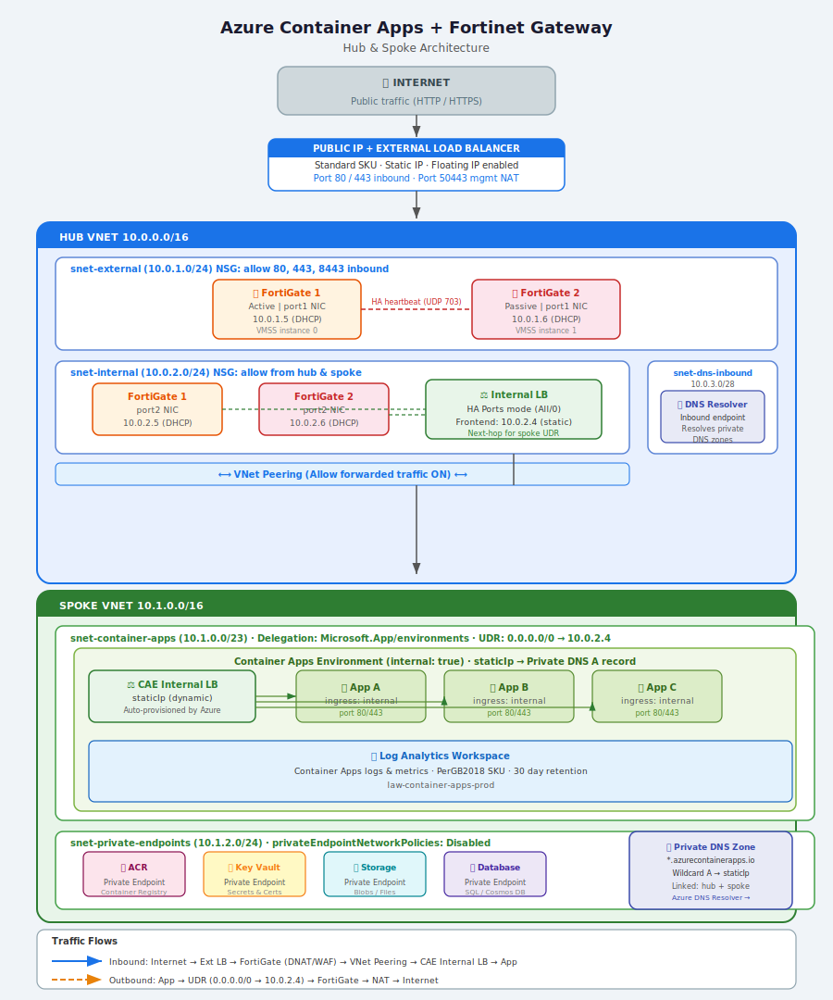

# Azure Container Apps + Fortinet Gateway — Hub & Spoke Architecture

A Bicep implementation of a private Azure Container Apps environment exposed to the internet via a Fortinet FortiGate NVA, using a hub-and-spoke network topology.

---

## Architecture Diagram



```
  ── Traffic flow (inbound) ──────────────────────────────────────────────────────
  Internet → Public IP → External LB → FortiGate port1
           → DNAT/VIP  → FortiGate port2 → Internal LB
           → VNet Peering → Container Apps internal LB → App

  ── Traffic flow (outbound) ─────────────────────────────────────────────────────
  Container App → UDR → FortiGate Internal LB → FortiGate port1 → NAT → Internet

  ── DNS resolution ──────────────────────────────────────────────────────────────
  *.azurecontainerapps.io → Private DNS Zone → Container Apps staticIp
```

---

## File Structure

```
├── main.bicep                     # Subscription-scoped entry point
├── main.bicepparam                # Parameters + deployment guide
└── modules/
    ├── hub-network.bicep          # Hub VNet, NSGs, ext/int LBs, Public IP
    ├── spoke-network.bicep        # Spoke VNet, NSGs, UDR → FortiGate
    ├── fortigate.bicep            # FortiGate VMSS (Active-Passive HA pair)
    ├── container-apps.bicep       # Log Analytics, CAE (internal), sample app
    ├── private-dns.bicep          # Private DNS zone + VNet links
    ├── dns-resolver.bicep         # Azure DNS Private Resolver
    └── vnet-peering.bicep         # Reusable peering module
```

---

## Key Design Decisions

### Two-Pass Deployment
The Container Apps Environment's static IP is not known until after it is created. The private DNS wildcard A record depends on this IP, so a second deployment pass is required to wire it up. The deployment guide in `main.bicepparam` walks through both passes.

### FortiGate Active-Passive HA (VMSS)
FortiGate is deployed as a VMSS with 2 instances. The external load balancer uses floating IP mode (required for FortiGate HA) and the internal load balancer uses HA-ports mode, routing all protocols to whichever FortiGate instance is active.

### UDR on the Container Apps Subnet
A User Defined Route forces all outbound traffic (`0.0.0.0/0`) from the Container Apps subnet through the FortiGate internal LB IP (`10.0.2.4`). The `AzureCloud` service tag is exempted to allow the Container Apps control plane to communicate with Azure services without being blocked.

### Internal-Only Container Apps Environment
The Container Apps Environment is deployed with `internal: true`, meaning it is assigned only a private IP and has no public endpoint. All inbound traffic must pass through the FortiGate, which performs DNAT via a Virtual IP (VIP) policy.

### DNS Private Resolver
An Azure DNS Private Resolver is deployed in the hub VNet, allowing the FortiGate and any on-premises systems connected via VPN or ExpressRoute to resolve private DNS zones without needing custom DNS servers on VMs.

### Private Endpoints
A dedicated `snet-private-endpoints` subnet is provisioned in the spoke for private endpoints to ACR, Key Vault, storage accounts, and databases — keeping all backend traffic off the public internet.

---

## IP Addressing Summary

| Subnet | CIDR | Purpose |
|---|---|---|
| snet-external (hub) | 10.0.1.0/24 | FortiGate port1 NICs + External LB |
| snet-internal (hub) | 10.0.2.0/24 | FortiGate port2 NICs + Internal LB |
| snet-dns-inbound (hub) | 10.0.3.0/28 | DNS Private Resolver inbound endpoint |
| snet-container-apps (spoke) | 10.1.0.0/23 | Container Apps Environment (min /23) |
| snet-private-endpoints (spoke) | 10.1.2.0/24 | Private endpoints for backend services |

---

## Prerequisites

```bash
az extension add --name containerapp
az provider register --namespace Microsoft.App
az provider register --namespace Microsoft.OperationalInsights
az provider register --namespace Microsoft.Network

# Accept FortiGate Marketplace terms
az vm image terms accept \
  --publisher fortinet \
  --offer fortinet_fortigate-vm_v5 \
  --plan fortinet_fg-vm_payg_2023
```

---

## Deployment

### Pass 1 — Deploy all infrastructure

```bash
az deployment sub create \
  --name deploy-hub-spoke \
  --location australiaeast \
  --template-file main.bicep \
  --parameters main.bicepparam \
  --parameters fortiGateAdminPassword='<your-secure-password>'
```

### Get the Container Apps static IP

```bash
STATIC_IP=$(az containerapp env show \
  --name cae-prod \
  --resource-group rg-spoke-prod \
  --query properties.staticIp -o tsv)
```

### Pass 2 — Wire up the private DNS A record

```bash
az deployment sub create \
  --name deploy-hub-spoke-dns \
  --location australiaeast \
  --template-file main.bicep \
  --parameters main.bicepparam \
  --parameters fortiGateAdminPassword='<your-secure-password>' \
  --parameters containerAppsLbIp=$STATIC_IP
```

---

## Post-Deployment: FortiGate Configuration

These steps must be performed via the FortiGate web console or SSH. Access the console via the NAT rule on port `50443` of the public IP.

### 1. Virtual IP (DNAT)

```
config firewall vip
  edit "vip-container-apps-https"
    set extintf "port1"
    set mappedip "<STATIC_IP>"
    set extport 443
    set mappedport 443
    set portforward enable
  next
end
```

### 2. Inbound Firewall Policy

```
config firewall policy
  edit 1
    set name "allow-inbound-https-to-aca"
    set srcintf "port1"
    set dstintf "port2"
    set action accept
    set srcaddr "all"
    set dstaddr "vip-container-apps-https"
    set schedule "always"
    set service "HTTPS"
    set utm-status enable
    set ssl-ssh-profile "certificate-inspection"
    set av-profile "default"
    set webfilter-profile "default"
    set logtraffic all
  next
end
```

### 3. Outbound Firewall Policy

```
config firewall policy
  edit 2
    set name "allow-outbound-from-aca"
    set srcintf "port2"
    set dstintf "port1"
    set action accept
    set srcaddr "10.1.0.0/23"
    set dstaddr "all"
    set schedule "always"
    set service "ALL"
    set nat enable
    set logtraffic all
  next
end
```

---

## Validation

```bash
# Resolve Container Apps hostname from within the VNet
nslookup app-sample-prod.<unique>.<region>.azurecontainerapps.io

# Test end-to-end via FortiGate public IP
curl -v https://<fortigate-public-ip>/

# Get deployment outputs
az deployment sub show --name deploy-hub-spoke \
  --query properties.outputs.fortiGatePublicIp.value -o tsv

az deployment sub show --name deploy-hub-spoke \
  --query properties.outputs.containerAppsDefaultDomain.value -o tsv
```

---

## Customisation Checklist

- [ ] Restrict the FortiGate management NSG rule to your admin IP range (currently open to `Internet`)
- [ ] Confirm the FortiGate Marketplace plan name is available in your subscription and region: `az vm image list --publisher fortinet --all`
- [ ] Set `zoneRedundant: true` on the Container Apps Environment for production deployments in supported regions
- [ ] Add additional Container Apps by duplicating the `sampleApp` resource in `container-apps.bicep`
- [ ] Add `containerAppsLbIp` as an optional parameter in `main.bicep` for the second deployment pass
- [ ] Store `fortiGateAdminPassword` in Azure Key Vault and reference it via a parameter file secret reference rather than passing it on the command line

---

## Resources

- [Azure Container Apps — Networking](https://learn.microsoft.com/en-us/azure/container-apps/networking)
- [FortiGate on Azure Deployment Guide](https://docs.fortinet.com/document/fortigate-public-cloud/7.4.0/azure-administration-guide)
- [Azure DNS Private Resolver](https://learn.microsoft.com/en-us/azure/dns/dns-private-resolver-overview)
- [Fortinet Azure Bicep Templates (GitHub)](https://github.com/fortinet/azure-templates)
